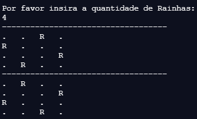

## __Introdução__

* O objetivo deste projeto foi desenvolver um programa para resolver o problema das N-Rainhas na linguagem Java. Este relatório apresenta a descrição do problema, explica o algoritmo, documenta o código e exemplifica o uso do programa.

## __Problema N-Rainhas__

* O problema consiste em posicionar um número N de rainhas em um tabuleiro de xadrez $X_{n,n}$. 
* A peça rainha pode ser movimentada em um número ilimitado de casas nas linhas, colunas ou diagonais.
* Uma posição é segura se não está na mesma linha, coluna ou diagonal de posições ocupadas.
 

## __Construção do Algoritmo__

* O programa consiste em um algoritmo que recebe uma entrada do usuário e retorna todos os possíveis posicionamentos seguros das rainhas no tabuleiro $X_{n,n}$.

* O algoritmo foi desenvolvido com a implementação de 4 funções e 2 classes:
  1. <__verifique__>
    + Verifica se uma posição é segura.
  3. <__posicione__>
    + Executa laço recursivo para iterar sobre o espaço de busca.
  3. <__imprima__>
    + Imprime soluções encontradas pelo programa.
  4. <__nRainhas__>
    + Executa a função posicione na classe NRainhas.
  5. <__inteiroNaoPositivo__>
    + Extende a classe exceção.
  6. <__NRainhas__>
    + Classe principal de que recebe input do usuário e executa o programa.

* O funcionamento do algoritmo consiste em iterar sobre as linhas e colunas do tabuleiro $X_{n,n}$ procurando uma posição segura para cada rainha. 

* O tabuleiro foi representado por um arranjo vetor X_{n} onde as colunas são as posições do vetor e as linhas os valores. 

* A verificação de segurança para linhas é realizada comparando os valores do vetor $X_{n}$. A verificação de segurança nas diagonais é realizada comparando índices e valores do vetor $X_{n}$.

* Caso uma posição selecionada inviabilize o posicionamento de qualquer rainha posterior, o algoritmo retorna e reposiciona as rainhas anteriores de forma recursiva até encontrar uma solução onde as __n__ rainhas estarão seguras.


### __1. Função Verifique__

* A primeira função denominada <__verifique__>, verifica se uma posição em uma determinada casa do tabuleiro é segura. As linhas, colunas e diagonais são inspecionadas e a função retorna verdadeiro se as condições de segurança da posição forem satisfeitas.

* A função recebe como parâmetros:
  1. Um arranjo de inteiros <__tabuleiro__> que representa o tabuleiro $X_{n}$ do problema.
  2. Número inteiro coluna que representa as colunas ou rainhas.

* O laço itera sobre todas as colunas do tabuleiro verificando 2 condições:
  1. Se a rainha está posicionada na mesma linha que as rainhas anteriores.
  2. Se a rainha está posicionada na mesma diagonal que as rainhas anteriores.
  
* Se as condições retornarem o valor verdadeiro, ou seja, existem duas rainhas na mesma linha ou diagonal, o programa retorna falso, ou seja, a nova posição não é segura. Caso contrário, a posição verificada é segura e a função retorna o valor verdadeiro.

    
```{js, eval = F, warning = F, error = F}

// Declara função de verificação privada com retorno boleano
private static boolean verifique(int[] tabuleiro, int coluna) {
  
  // Laço para verificar linha
  for (int i = 0; i < coluna; i++) {
    
    // Verfica condição de linha
    if (tabuleiro[i] == tabuleiro[coluna])
      
      // Se verdadeiro retorna falso ou posição não segura
      return false;
    
    // Verfica condição de diagonal
    if ((coluna - i) == Math.abs(tabuleiro[coluna] - tabuleiro[i])) {
      
      // Se verdadeiro retorna falso ou posição não segura
      return false;
    }
  }
  
  // Retorna verdadeiro se a posição é segura
  return true;
}

```

### __1. Função Posicione__

* A segunda função denominada <__posicione__>, itera sobre o tabuleiro de forma recursiva.

* A função recebe como parâmetros:
  1. O arranjo vetor de inteiros <__tabuleiro__> $X_{n}$.
  2. O inteiro <__coluna__> que representa a coluna da vez.
  3. O inteiro <__n__> que representa o máximo de rainhas.
  
* O laço itera sobre as colunas executando 3 tarefas:
  1. Popula o arranjo <__tabuleiro__>.
    + A posição do arranjo <__tabuleiro__> recebe a linha segura para posicionamento.
  2. Verifica se a posição (coluna, linha) é segura.
    + Executa a função verifique com parâmetros <__tabuleiro__> e <__coluna__> da vez.
  3. Executa <__posicione__> de forma recursiva.
    + Caso a condição retornar verdadeiro, ou seja, posição segura, a função posicione é executada de forma recursiva alterando a coluna da vez para a próxima coluna.

   
```{js, eval = F, warning = F, error = F}

// Declare função privada posicione com retorno vazio
private static void posicione(int[] tabuleiro, int coluna, int n) {
    
  // Condição de parada considerando o tamanho do problema
  if (coluna == n) {
    
    // Se verdadeiro imprime o tabuleiro
    imprima(tabuleiro);
    
    // Retorna vazio
    return;
  }
  
  // Laço para posicionar as rainhas
  for (int i = 0; i < n; i++) {
    
    // Popula rainha da vez para teste
    tabuleiro[coluna] = i;
    
    // Condição de verificação da posição
    if (verifique(tabuleiro, coluna)) {
      
      // Se verdadeiro popula tabuleiro
      posicione(tabuleiro, coluna + 1, n);
    }
  }
}

```

### __3. Função Imprima__

* A terceira função denominada <__imprima__>, imprime os resultados do algoritmo no formato de um tabuleiro.

* Recebe como parâmetro de entrada o arranjo de inteiros <__tabuleiro__> da solução do problema.

* Itera sobre o tabuleiro imprimindo __'R'__ para posição com rainha e __'.'__ para posição vazia.

* Os tabuleiros foram separados por uma sequência de hífens __'- - - - - - - - - -'__.

* A condição de tabuleiro é verificada em cada impressão para evitar impressão de tabuleiros com entradas inválidas.


```{js, eval = F, warning = F, error = F}

// Declara função imprima estatica privada com retorno vazio
private static void imprima(int[] tabuleiro) {
  
  // Declara tamanho do tabuleiro
  int tamanho = tabuleiro.length;
  
  // Condição de Separação
  if(tamanho > 1)
  
    // Quebra de linha e divisão
    System.out.print("-----------------------------------");
    System.out.print("\n");
  
  // Laços para impressão do tabuleiro
  for (int i = 0; i < tamanho; i++) {
    for (int valor : tabuleiro) {
      
      // Condição de Rainhas
      if (valor == i && tamanho > 1)
        
        // Imprime rainha
        System.out.print("R\t");
      
      else if(valor != i && tamanho > 1)
        
        // Imprime posição vazia
        System.out.print(".\t");
    }
    
    // Condição de quebra de linha
    if(tamanho > 1)
    
      // Imprime quebra de linha e separador
      System.out.print("\n");
    
  }
  
}

```

### __4. Função nRainhas__

* A função <__n_rainhas__> foi construída para gerar o arranjo de inteiros tabuleiro $X_{n}$ que será populado pela solução construída na execução da função posicione iniciada na coluna 0.


```{js, eval = F, warning = F, error = F}

 // Declara função estática privada NRainhas
  private static void nRainhas(int n) {
    
    // Declara tabuleiro com dimensão de N_rainhas
    int [] tabuleiro = new int[n];
    
    // Posiciona rainhas no tabuleiro
    posicione(tabuleiro, 0, n);
  }

```


### __5. Classe inteiroNaoPositivo__

* A biblioteca _java.utils_ foi utilizada para extender a classe <__Exception__>.

* A classe <__interoNaoPositivo__> foi construída para gerar exceção se a entrada do usuário não é um número inteiro. O construtor <__this__> recebe o parâmetro <__numero__> com tipo inteiro que será verificado pela extensão da exceção.


```{js, eval = F, warning = F, error = F}

// Importa biblioteca de utilidades para escanear entrada do usuário
import java.util.*;

// Declara nova classe de exceção
class inteiroNaoPositivo extends Exception {

    // Declara variável
    private int naoPositivo = 0;

    // Construtor com argumento de inteiro
    public inteiroNaoPositivo(int numero) {

        // Declara atributo número
        this.naoPositivo = numero;
    }
}

```


### __6. Classe NRainhas__

* A classe principal NRainhas foi desenvolvida para controlar e executar o programa.

* Composta de uma função principal e uma declaração <__try__> bloco de teste.
  1. Função Principal <__main__>:
    + Recebe o argumento <__args__> que é uma estrutura de dados arranjo do tipo _String_:
    + Declara inteiro <__numeroEntrada__> inicializado com valor 0.
    + Declara inteiro <__n__> de entrada inicializado com valor 1.
    + Declara objeto entrada do tipo <__Scanner__> para recuperar a escolha do usuário.
  2. Bloco de Testes <__try__>:
    + Imprime mensagem requisitando a escolha do usuário para determinar o número de rainhas.
    + Aciona módulo próximo inteiro do objeto <__entrada__> tipo _Scanner_.
    + Verifica se número de entrada é negativo:
      + Se verdadeiro lança exceção interiroNaoPositivo.
      + Se falso pula.
    + Atribui número de entrada a variável n.
    + Declarações <__catch__>:
      + 1º <__catch__> imprime mensagem de erros se a entrada é negativa e reinicia o programa.
      + 2º <__catch__> imprime mensagem de erros se a entrada é diferente de inteiro e reinicia o programa.
    + A declaração <__finally__> permite executar código depois de <__try__> 
      + Executa a função <__n_rainhas__> com parâmetro <__n__>.


```{js, eval = F, warning = F, error = F}

// Declara classe publica principal
public class NRainhas {
  
  // Declara classe publica estática com retorno vazio
  public static void main(String[] args) {
    
    // Declara variáveis
    int numeroEntrada = 0; int n = 1;
    
    // Inicializa escaneador entrada
    Scanner entrada = new Scanner(System.in);
    
    // Teste de entrada
    try {
      
      // Solicita entrada do usuário
      System.out.println("Por favor insira a quantidade de Rainhas:");
      
      // Declara entrada
      numeroEntrada = entrada.nextInt();
      
      // Condição de negativo
      if (numeroEntrada < 0) {
        
        // Lança exceção de inteiro não negativo
        throw new inteiroNaoPositivo(numeroEntrada);
      } 
      
      // Caso contrário declara variável n com entrada do usuário
      n = numeroEntrada;
      
    // Captura exceção de não positivo
    } catch (inteiroNaoPositivo e) {
      
      // Menssagem para usuário
      System.out.println("Entrada de inteiro negativo recusada!\n");
      main(args);
      
    // Captura exceção de entrada diferente de inteiro
    } catch (InputMismatchException e) {
      
      // Menssagem de entrada diferente de inteiro
      System.out.println("Entrada diferente de inteiro recusada!\n");
      main(args);
      
    // Retorno dos testes
    } finally {
      
      // Chama a função nRainhas com parâmetro n
      nRainhas(n);
    }
}

```


## __Exemplo__

* Um exemplo da execução do programa é a resolução do problema com o parâmetro <__4__> para indicar a resolução do problema com 4 rainhas em um tabuleiro 4 x 4.


* A JVM do __replit__  permite executar o programa no sítio:
  * [\textcolor{blue}{https://replit.com}](https://replit.com/@PedroLadeira/N-Rainhas-Java#Main.java)
  
* O Programa pode ser compilado e executado de 2 formas:
  1. Acionando o botão $\fbox{Run}$ do menu superior central.
  2. Digitando os seguintes comando no Shell da janela principal da direita:
    + <__javac Main.java__>
    + <__java Main__>

* Saída do Programa para o exemplo com 4 rainhas no tabuleiro 4 x 4:

&nbsp;&nbsp;&nbsp;&nbsp;&nbsp;&nbsp;&nbsp;&nbsp;&nbsp;&nbsp;


## Referências

* [\textcolor{blue}{https://homepages.dcc.ufmg.br/~bigonha}](https://homepages.dcc.ufmg.br/~bigonha/Livros/poo-java.pdf)

* [\textcolor{blue}{www.tutorialspoint.com/java}](https://www.tutorialspoint.com/java/)

* [\textcolor{blue}{You Tube}](https://www.youtube.com/watch?v=n-xAqcBCws4)


