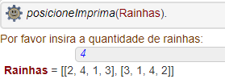

## __Introdução__

* O objetivo deste projeto foi desenvolver um programa para resolver o problema das N-Rainhas na linguagem lógica Prolog. Este relatório apresenta a descrição do problema, explica o algoritmo, documenta o código e exemplifica o uso do programa.

## __Problema N-Rainhas__

* O problema consiste em posicionar um número N de rainhas em um tabuleiro de xadrez $X_{N,N}$. 
* A peça rainha pode ser movimentada em um número ilimitado de casas nas linhas, colunas ou diagonais.
* Uma posição é segura se não está na mesma linha, coluna ou diagonal de outras posições ocupadas por outras rainhas.

## __Construção do Algoritmo__

* O algoritmo foi desenvolvido com a implementação de 4 procedimentos:
  1. <__verifique__>
    + Verifica se uma posição é segura.
  2. <__inteiro__>
    + Verifica condição de tipo inteiro.
  3. <__positivo__>
    + Verifica condição de domínio positivo.
  4. <__posicioneImprima__>
    + Gera permutações para o espaço de busca, executa <__verifique__> e imprime soluções.
  
    
* O objetivo do programa é posicionar um número __n__ de rainhas fornecido pelo usuário.

* O funcionamento do algoritmo consiste em gerar todas as permutações de linhas e colunas possíveis e verificar quais dessas posições atendem as condições de segurança. 

* A verificação de segurança para linhas e colunas é realizada comparando a soma dos índices das linhas e colunas com o termo da adição com linhas que geram as colunas.

### __1. Verifique__

* O primeiro procedimento denominado <__verifique__>, verifica se uma posição em uma determinada casa do tabuleiro é segura.

* As linhas e colunas são inspecionadas para verificar se a posição é segura.

* Os procedimentos <__maplist__>, <__plus__> e <__is_set__> da biblioteca base de linguagem Prolog foram utilizados. 

* O procedimento recebe como parâmetros:
  1. A lista <__Linhas__>.
  2. A lista <__Colunas__>.

* O procedimento de <__maplist__> itera sobre duas condições:
  1. Calcula a soma de Linhas e Colunas.
    + O procedimento <__plus__> executa a adição de cada elemento das listas e retorna Somas.
  2. Calcula o termo da adição que somado com as Linhas gera uma lista equivalente às colunas.
    + O procedimento <__plus__> executa a adição de cada elemento das listas e retorna Termos.
    
* O procedimento <__is_set__> é utilizado 2 vezes para verificar se os conjuntos <__Somas__> e <__Termos__> possuem elementos duplicados.

```{prolog, eval = F, warning = F, error = F}

% Declara procedimento verifique 
verifique(Linhas, Colunas) :-
  
  % Mapeia função plus para somar Linhas e Colunas  
  maplist(plus, Linhas, Colunas, Somas),
    
  % Mapeia a função plus para somar Linhas e Termos
  maplist(plus, Linhas, Termos, Colunas),
    
  % Verifica se conjuto Somas não possui elementos duplicados  
  is_set(Somas),
    
  % Verifica se conjuto Termos não possui elementos duplicados  
  is_set(Termos).
  
```

### __2. Inteiro__

* O procedimento <__inteiro__> recebe o parâmetro <__N__> de entrada e verifica se esse parâmetro é um inteiro.

* Se o procedimento avaliar como falso uma mensagem de erro é impressa.


```{prolog,eval = F, warning = F, error = F}

% Declara procedimento inteiro para lidar com excessão de tipo.
inteiro(N) :-
    (integer(N)
    -> integer(N)
    ; print("ERRO: O parâmetro fornecido não é um inteiro!")
    ).

```

### __2. Positivo__

* O procedimento <__positivo__> recebe o parâmetro <__N__> de entrada e verifica se esse parâmetro é um inteiro positivo.

* Se o procedimento avaliar como falso uma mensagem de erro é impressa.

```{prolog,eval = F, warning = F, error = F}

% Declara procedimento positivo para lidar com excessão de domínio da veriável.
positivo(N) :-
    ( N > 0
    -> N > 0 
    ; print("ERRO: O parâmetro fornecido não é um inteiro positivo!")
    ).

```

### __4. Posicione Imprima__

* O terceiro procedimento denominado <__posicioneImprima__>, avalia exceções de inteiro e positivo na entrada do usuário, posiciona permutações de rainhas seguras e imprime os possíveis resultados.

* Recebe como parâmetro <__Sol__> que pode ser qualquer palavra onde os resultados serão armazenados no formato de listas.

* O procedimento é inicializado com a impressão de uma mensagem requisitando que o usuário insira o número de rainhas para serem posicionadas.

* A entrada do usuário é armazenada na variável <__Rainhas__>.

* As verificações <__inteiro__> e <__positivo__> são realizadas.

* Uma lista com a quantidade de rainhas é declarada

* Finalmente o procedimento <__findall__> é executado para encontrar a <__Posicao__> de cada permutação que avalia como verdadeiro no procedimento verifique e retorna as soluções no parâmetro <__Sol__>.

```{prolog, eval = F, warning = F, error = F}

% Declara procedimento posicione
posicioneImprima(Sol) :-
  
  % Mensagem para o usuário  
  write('Por favor insira a quantidade de rainhas: '),
    
  % Leitura
  read(Rainhas),  
    
  % Verifica se a entrada é um número inteiro e positivo  
  inteiro(Rainhas),
  positivo(Rainhas),
    
  % Gera lista de posições 1, ..., Rainhas  
  numlist(1, Rainhas, Colunas),

  % Procura todas as permutações onde as condições de segurança são satisfeitas 
  findall(Posicao, (permutation(Colunas, Posicao), verifique(Posicao, Colunas)), Sol).

```


## __Exemplo__

* Um exemplo da execução do programa é a resolução do problema com o parâmetro <__4__> para indicar a resolução do problema com 4 rainhas em um tabuleiro 4 x 4.

* Para executar o programa o usuário deve digitar a consulta abaixo com qualquer nome de sua preferência para ser o nome da lista de soluções na impressão e acionar o botão $\fbox{Run}$ no canto inferior direito ou por meio atalho __CTRL + Enter__.

* Em seguida, o usuário deve inserir o número de rainhas que deseja posicionar.

* Finalmente o programa gera uma saída com as 2 posições para a opção de 4 rainhas em um tabuleiro 4 x 4.


```{prolog, eval = F, warning = F, error = F}

?- posicioneImprima(Rainhas).

```

&nbsp;&nbsp;&nbsp;&nbsp;&nbsp;


* O compilador Prolog do servidor __swish__  permite executar o programa no sítio:
  * [\textcolor{blue}{https://swish.swi-prolog.org}](https://swish.swi-prolog.org/p/NRainhas.pl)


## Referências

* [\textcolor{blue}{https://swi-prolog-reference}](https://swi-prolog.discourse.group/t/useful-prolog-references/1089)

* [\textcolor{blue}{https://www.tutorialspoint.com/prolog/}](https://www.tutorialspoint.com/prolog/)

* [\textcolor{blue}{You Tube}](https://www.youtube.com/watch?v=SykxWpFwMGs)


