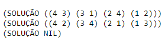

## __Introdução__

* O objetivo deste projeto foi desenvolver um programa para resolver o problema das N-Rainhas na linguagem funcional Common Lisp. Este relatório apresenta a descrição do problema, explica o algorítimo, documenta o código e exemplifica o uso do programa.

## __Problema N-Rainhas__

* O problema consiste em posicionar um número N de rainhas em um tabuleiro de xadrez $X_{N,N}$. 
* A peça rainha pode ser movimentada um número ilimitado de casas nas linhas, colunas ou diagonais.
* Uma posição é segura se não está na mesma linha, coluna ou diagonal das posições ocupadas por outras rainhas.

## __Construção do Algoritmo__

* O algoritmo foi desenvolvido com a implementação de 3 funções:
  1. <__verifique__>
    + Verifica se uma posição é segura.
  2. <__posicione__>
    + Executa laço para iterar sobre o espaço de busca.
  3. <__imprima__>
    + Imprime soluções encontradas pelo programa.
    
* O objetivo do programa é posicionar um número __n__ de rainhas fornecido pelo usuário.

* O funcionamento do algoritmo consiste em iterar sobre as linhas e colunas do tabuleiro $X_{n,n}$ procurando uma posição segura para cada rainha. 

* A verificação de segurança para linhas e colunas é realizada comparando os índices da possível nova posição com os índices de dominância das rainhas já posicionadas.

* A verificação de segurança nas diagonais é confirmada se o valor absoluto da divisão das distâncias entre as rainhas for diferente de 1.

* Caso uma posição selecionada inviabilize o posicionamento de qualquer rainha posterior, o algoritmo retorna e reposiciona as rainhas anteriores de forma recursiva até encontrar uma solução onde as __n__ rainhas estarão seguras.

### __1. Verifique__

* A primeira função denominada <__verifique__>, verifica se uma posição em uma determinada casa do tabuleiro é segura.

* As linhas, colunas e diagonais são inspecionadas e a função retorna verdadeiro se as condições de segurança da posição forem satisfeitas.

* As funções <__cond__>, <__member__>, <__mapcar__>, <__car__>, <__cadr__>, <__lambda__> e <__abs__> da biblioteca base de linguagem Common Lisp foram utilizadas. 

* A função recebe como parâmetros:
  1. A posição <__x__> no tabuleiro.
  2. A posição <__y__> no tabuleiro.
  3. A lista das posições das rainhas.

* A função de <__cond__> avalia duas condições:
  1. Se a rainha é membra da mesma linha que as rainhas anteriores.
    + A função <__member__> avalia se é verdadeiro o pertencimento da rainha a uma posição segura.
    + A função mapcar avalia cada posição em relação a lista de rainhas.
    + A função lambda recebe com parâmetros a lista xy e aplica o mapcar para linhas e colunas.
    + A expressão lógica or avalia se <__x__> é igual a primeira posição ou <__y__> à segunda.
  2. Se a rainha é membra da mesma diagonal que a das rainhas anteriores.
    + A função <__member__> avalia se é verdadeiro o pertencimento da rainha a uma posição segura.
    + A função mapcar avalia cada posição em relação a lista de rainhas.
    + A função lambda recebe com parâmetros a lista xy e a aplica o mapcar para diagonais.
    + A expressão lógica <__or__> avalia se o valor absoluto da divisão de <__x__> - a primeira posição por <__y__> - segunda posição de <__xy__> é igual a 1.

```{lisp,eval = F, warning = F, error = F}

; Define função condição de segurança da rainha na posição x y
(defun verifique (x y rainhas)
    
  ; Verifica condição de posicionamento da rainha
  (cond 
      
    ; Verifica se rainha da vez é membro da condição de linha
    ((member t (mapcar #'(lambda (xy)
                           (or (= x (car xy)) (= y (cadr xy)))) rainhas)) nil)
    
    ; Verifica se rainha da vez é membro da condição diagonal
    ((member t (mapcar #'(lambda (xy) 
                           (= 1 (abs (/ (- x (car xy)) (- y (cadr xy)))))) rainhas)) nil)
      
    ; Retorna verdadeiro  
    (t)
  )
)

```

### __1. Posicione__

* A segunda função denominada <__posicione__>, itera sobre o tabuleiro.

* A função recebe como parâmetros:
  1. A posição <__x__> no tabuleiro.
  2. A posição <__y__> no tabuleiro.
  3. A lista das posições das <__rainhas__>.
  4. Número máximo <__n__> de rainhas e dimensão do tabuleiro.
  
* A função de <__cond__> avalia três condições:
  1. Se o tamanho da lista de rainhas posicionadas é igual ao máximo
    + Caso verdadeiro imprime tupla (coluna, linha) da maior para menor.
  2. Se <__x__> ou <__y__> é maior que o máximo
    + Caso verdadeiro passa para próxima rainha da lista rainhas.
  3. Se <__verifica__> permite o posicionamento.
    + Caso verdadeiro adiciona posição a lista rainha caso contrário chama a função verifica de forma recursiva nas posições <__x__> + 1 e <__y__> + 1.

```{lisp,eval = F, warning = F, error = F}

; Define posicionamento recursivo da rainha em x e y na ordem: (1 1) ~ (n n)
(defun posicione (x y rainhas n)
    
  ; Condição de posicionamento seguro  
  (cond
      
    ; Se verdadeiro Imprime tuplas (coluna linha) de posições da solução
    ((= n (length rainhas)) (print (list 'Solução rainhas)) (cdr rainhas))
    
    ; Caso contrário passa para proxima (coluna linha)
    ((or (> x n) (> y n)) (cdr rainhas)) 
    
    ; Verifica se pode posicionar a rainha
    ((verifique x y rainhas)
    
      ; Define conjunto, aplica laço recursivo com contador x + 1 e empilha rainha
      (setq rec (posicione (+ 1 x) 1 (append (list (list x y)) rainhas) n))
      
      ; Verifica condição de coluna
      (cond
          
        ; Condição de laço recursivo com contador y + 1 e conjunto rec verdadeiro
        ((equal rainhas rec) (posicione x (+ 1 y) rainhas n)) 
        (t rec)
      )
     )
        
    ; Executa a função de forma recursiva incrementando coluna y
    (t (posicione x (+ 1 y) rainhas n))
  )
)

```


### __3. Imprima__

* A terceira função denominada <__imprima__>, imprime os resultados do algoritmo no formato de tuplas da última coluna para a primeira.

* A função recebe como parâmetros:
  1. O máximo <__n__> de rainhas e tamanho do tabuleiro.
  2. Uma lista vazia __()__ para popular com os posicionamentos.
  
* A função imprima executa a chamada recursiva da função posicione começando com <__x__> = 1 e <__y__> = 1 e passando os parâmetros da lista vazia e tamanho do problema <__n__> que define o número de rainhas e dimensões do tabuleiro.

```{lisp, eval = F, warning = F, error = F}

; Define função imprima
(defun imprima (n rainhas)

    ; Executa função posicione
    (posicione 1 1 rainhas n))

```


## __Exemplo__

* Um exemplo da execução do programa é a resolução do problema com os parâmetros:
  1. <__4__> para indicar a resolução do problema com 4 rainhas em um tabuleiro 4 x 4.
  2. <__()__> lista vazia para ser populada pelo programa com as soluções.

```{lisp, eval = F, warning = F, error = F}

; Imprime solução com 4 rainhas
(print (list 'Solução (imprima 4 '()))) 

```



* O compilador Common Lisp do servidor __rextester__  permite executar o programa no sítio:
  * [\textcolor{blue}{https://rextester.com}](https://rextester.com/edit/QJIOB78933)


## Referências

* [\textcolor{blue}{Pratical Common Lisp}](https://gigamonkeys.com/book/)

* [\textcolor{blue}{www.tutorialspoint.com/lisp}](https://www.tutorialspoint.com/lisp/)

* [\textcolor{blue}{You Tube}](https://www.youtube.com/watch?v=ymSq4wHrqyU)


