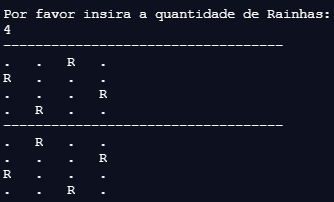
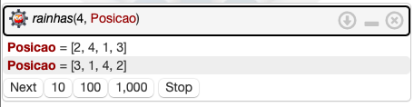

\newpage

## __Introdução__

* O objetivo deste projeto foi desenvolver um programa para resolver o problema das N-Rainhas utilizando linguagens de 3 paradigmas: imperativo, lógico e funcional, 
para as quais foram escolhidas as linguagens Java, Prolog e Lisp, respectivamente. Este relatório apresenta a descrição do problema, explica os algoritmo desenvolvidos, 
documenta os códigos e exemplifica o uso dos programas.

## __Problema N-Rainhas__

* O problema consiste em posicionar um número N de rainhas em um tabuleiro de xadrez $X_{n,n}$. 
* A peça rainha pode ser movimentada em um número ilimitado de casas nas linhas, colunas ou diagonais.
* Uma posição é segura se não está na mesma linha, coluna ou diagonal de posições ocupadas.

## __Java__
### __Construção do Algoritmo__

* O programa consiste em um algoritmo que recebe uma entrada do usuário e retorna todos os possíveis posicionamentos seguros das rainhas no tabuleiro $X_{n,n}$.

* O algoritmo foi desenvolvido com a implementação de 4 funções e 2 classes:
  1. <__verifique__>
    + Verifica se uma posição é segura.
  3. <__posicione__>
    + Executa laço recursivo para iterar sobre o espaço de busca.
  3. <__imprima__>
    + Imprime soluções encontradas pelo programa.
  4. <__nRainhas__>
    + Executa a função posicione na classe NRainhas.
  5. <__inteiroNaoPositivo__>
    + Extende a classe exceção.
  6. <__NRainhas__>
    + Classe principal de que recebe input do usuário e executa o programa.

* O funcionamento do algoritmo consiste em iterar sobre as linhas e colunas do tabuleiro $X_{n,n}$ procurando uma posição segura para cada rainha. 

* O tabuleiro foi representado por um arranjo vetor X_{n} onde as colunas são as posições do vetor e as linhas os valores. 

* A verificação de segurança para linhas é realizada comparando os valores do vetor $X_{n}$. A verificação de segurança nas diagonais é realizada comparando índices e valores do vetor $X_{n}$.

* Caso uma posição selecionada inviabilize o posicionamento de qualquer rainha posterior, o algoritmo retorna e reposiciona as rainhas anteriores de forma recursiva até encontrar uma solução onde as __n__ rainhas estarão seguras.


#### __1. Função Verifique__

* A primeira função denominada <__verifique__>, verifica se uma posição em uma determinada casa do tabuleiro é segura. As linhas, colunas e diagonais são inspecionadas e a função retorna verdadeiro se as condições de segurança da posição forem satisfeitas.

* A função recebe como parâmetros:
  1. Um arranjo de inteiros <__tabuleiro__> que representa o tabuleiro $X_{n}$ do problema.
  2. Número inteiro coluna que representa as colunas ou rainhas.

* O laço itera sobre todas as colunas do tabuleiro verificando 2 condições:
  1. Se a rainha está posicionada na mesma linha que as rainhas anteriores.
  2. Se a rainha está posicionada na mesma diagonal que as rainhas anteriores.
  
* Se as condições retornarem o valor verdadeiro, ou seja, existem duas rainhas na mesma linha ou diagonal, o programa retorna falso, ou seja, a nova posição não é segura. Caso contrário, a posição verificada é segura e a função retorna o valor verdadeiro.

    
```{js, eval = F, warning = F, error = F}

// Declara função de verificação privada com retorno boleano
private static boolean verifique(int[] tabuleiro, int coluna) {
  
  // Laço para verificar linha
  for (int i = 0; i < coluna; i++) {
    
    // Verfica condição de linha
    if (tabuleiro[i] == tabuleiro[coluna])
      
      // Se verdadeiro retorna falso ou posição não segura
      return false;
    
    // Verfica condição de diagonal
    if ((coluna - i) == Math.abs(tabuleiro[coluna] - tabuleiro[i])) {
      
      // Se verdadeiro retorna falso ou posição não segura
      return false;
    }
  }
  
  // Retorna verdadeiro se a posição é segura
  return true;
}

```

#### __2. Função Posicione__

* A segunda função denominada <__posicione__>, itera sobre o tabuleiro de forma recursiva.

* A função recebe como parâmetros:
  1. O arranjo vetor de inteiros <__tabuleiro__> $X_{n}$.
  2. O inteiro <__coluna__> que representa a coluna da vez.
  3. O inteiro <__n__> que representa o máximo de rainhas.
  
* O laço itera sobre as colunas executando 3 tarefas:
  1. Popula o arranjo <__tabuleiro__>.
    + A posição do arranjo <__tabuleiro__> recebe a linha segura para posicionamento.
  2. Verifica se a posição (coluna, linha) é segura.
    + Executa a função verifique com parâmetros <__tabuleiro__> e <__coluna__> da vez.
  3. Executa <__posicione__> de forma recursiva.
    + Caso a condição retornar verdadeiro, ou seja, posição segura, a função posicione é executada de forma recursiva alterando a coluna da vez para a próxima coluna.

   
```{js, eval = F, warning = F, error = F}

// Declare função privada posicione com retorno vazio
private static void posicione(int[] tabuleiro, int coluna, int n) {
    
  // Condição de parada considerando o tamanho do problema
  if (coluna == n) {
    
    // Se verdadeiro imprime o tabuleiro
    imprima(tabuleiro);
    
    // Retorna vazio
    return;
  }
  
  // Laço para posicionar as rainhas
  for (int i = 0; i < n; i++) {
    
    // Popula rainha da vez para teste
    tabuleiro[coluna] = i;
    
    // Condição de verificação da posição
    if (verifique(tabuleiro, coluna)) {
      
      // Se verdadeiro popula tabuleiro
      posicione(tabuleiro, coluna + 1, n);
    }
  }
}

```

#### __3. Função Imprima__

* A terceira função denominada <__imprima__>, imprime os resultados do algoritmo no formato de um tabuleiro.

* Recebe como parâmetro de entrada o arranjo de inteiros <__tabuleiro__> da solução do problema.

* Itera sobre o tabuleiro imprimindo __'R'__ para posição com rainha e __'.'__ para posição vazia.

* Os tabuleiros foram separados por uma sequência de hífens __'- - - - - - - - - -'__.

* A condição de tabuleiro é verificada em cada impressão para evitar impressão de tabuleiros com entradas inválidas.


```{js, eval = F, warning = F, error = F}

// Declara função imprima estatica privada com retorno vazio
private static void imprima(int[] tabuleiro) {
  
  // Declara tamanho do tabuleiro
  int tamanho = tabuleiro.length;
  
  // Condição de Separação
  if(tamanho > 1)
  
    // Quebra de linha e divisão
    System.out.print("-----------------------------------");
    System.out.print("\n");
  
  // Laços para impressão do tabuleiro
  for (int i = 0; i < tamanho; i++) {
    for (int valor : tabuleiro) {
      
      // Condição de Rainhas
      if (valor == i && tamanho > 1)
        
        // Imprime rainha
        System.out.print("R\t");
      
      else if(valor != i && tamanho > 1)
        
        // Imprime posição vazia
        System.out.print(".\t");
    }
    
    // Condição de quebra de linha
    if(tamanho > 1)
    
      // Imprime quebra de linha e separador
      System.out.print("\n");
    
  }
  
}

```

#### __4. Função nRainhas__

* A função <__n_rainhas__> foi construída para gerar o arranjo de inteiros tabuleiro $X_{n}$ que será populado pela solução construída na execução da função posicione iniciada na coluna 0.


```{js, eval = F, warning = F, error = F}

 // Declara função estática privada NRainhas
  private static void nRainhas(int n) {
    
    // Declara tabuleiro com dimensão de N_rainhas
    int [] tabuleiro = new int[n];
    
    // Posiciona rainhas no tabuleiro
    posicione(tabuleiro, 0, n);
  }

```


#### __5. Classe inteiroNaoPositivo__

* A biblioteca _java.utils_ foi utilizada para extender a classe <__Exception__>.

* A classe <__interoNaoPositivo__> foi construída para gerar exceção se a entrada do usuário não é um número inteiro. O construtor <__this__> recebe o parâmetro <__numero__> com tipo inteiro que será verificado pela extensão da exceção.


```{js, eval = F, warning = F, error = F}

// Importa biblioteca de utilidades para escanear entrada do usuário
import java.util.*;

// Declara nova classe de exceção
class inteiroNaoPositivo extends Exception {

    // Declara variável
    private int naoPositivo = 0;

    // Construtor com argumento de inteiro
    public inteiroNaoPositivo(int numero) {

        // Declara atributo número
        this.naoPositivo = numero;
    }
}

```

#### __6. Classe NRainhas__

* A classe principal NRainhas foi desenvolvida para controlar e executar o programa.

* Composta de uma função principal e uma declaração <__try__> bloco de teste.
  1. Função Principal <__main__>:
    + Recebe o argumento <__args__> que é uma estrutura de dados arranjo do tipo _String_:
    + Declara inteiro <__numeroEntrada__> inicializado com valor 0.
    + Declara inteiro <__n__> de entrada inicializado com valor 1.
    + Declara objeto entrada do tipo <__Scanner__> para recuperar a escolha do usuário.
  2. Bloco de Testes <__try__>:
    + Imprime mensagem requisitando a escolha do usuário para determinar o número de rainhas.
    + Aciona módulo próximo inteiro do objeto <__entrada__> tipo _Scanner_.
    + Verifica se número de entrada é negativo:
      + Se verdadeiro lança exceção interiroNaoPositivo.
      + Se falso pula.
    + Atribui número de entrada a variável n.
    + Declarações <__catch__>:
      + 1º <__catch__> imprime mensagem de erros se a entrada é negativa e reinicia o programa.
      + 2º <__catch__> imprime mensagem de erros se a entrada é diferente de inteiro e reinicia o programa.
    + A declaração <__finally__> permite executar código depois de <__try__> 
      + Executa a função <__n_rainhas__> com parâmetro <__n__>.


```{js, eval = F, warning = F, error = F}

// Declara classe publica principal
public class NRainhas {
  
  // Declara classe publica estática com retorno vazio
  public static void main(String[] args) {
    
    // Declara variáveis
    int numeroEntrada = 0; int n = 1;
    
    // Inicializa escaneador entrada
    Scanner entrada = new Scanner(System.in);
    
    // Teste de entrada
    try {
      
      // Solicita entrada do usuário
      System.out.println("Por favor insira a quantidade de Rainhas:");
      
      // Declara entrada
      numeroEntrada = entrada.nextInt();
      
      // Condição de negativo
      if (numeroEntrada < 0) {
        
        // Lança exceção de inteiro não negativo
        throw new inteiroNaoPositivo(numeroEntrada);
      } 
      
      // Caso contrário declara variável n com entrada do usuário
      n = numeroEntrada;
      
    // Captura exceção de não positivo
    } catch (inteiroNaoPositivo e) {
      
      // Menssagem para usuário
      System.out.println("Entrada de inteiro negativo recusada!\n");
      main(args);
      
    // Captura exceção de entrada diferente de inteiro
    } catch (InputMismatchException e) {
      
      // Menssagem de entrada diferente de inteiro
      System.out.println("Entrada diferente de inteiro recusada!\n");
      main(args);
      
    // Retorno dos testes
    } finally {
      
      // Chama a função nRainhas com parâmetro n
      nRainhas(n);
    }
}

```


### __Exemplo__

* Um exemplo da execução do programa é a resolução do problema com o parâmetro <__4__> para indicar a resolução do problema com 4 rainhas em um tabuleiro 4 x 4.

* Saída do Programa para o exemplo com 4 rainhas no tabuleiro 4 x 4:

&nbsp;&nbsp;&nbsp;&nbsp;&nbsp;&nbsp;&nbsp;&nbsp;&nbsp;&nbsp;


### __Compilador para Execução__

Abaixo é possível acessar o compilador online utilizado para a execução dos algoritmo

* A JVM do __replit__  permite executar o programa no sítio [\textcolor{blue}{https://replit.com}](https://replit.com/@PedroLadeira/N-Rainhas-Java#Main.java)
  
    * O Programa pode ser compilado e executado de 2 formas:
        1. Acionando o botão $\fbox{Run}$ do menu superior central.
        2. Digitando os seguintes comando no Shell da janela principal da direita:
            + <__javac Main.java__>
            + <__java Main__>

## __Prolog__
### __Construção do Algoritmo__

* O algoritmo foi construindo implementando as condições e restrições necessárias ao problema. Inicialmente uma lista é construida contendo os seguintes valores: $N, N-1, N-2, ..., 1$ e em seguida essa lista é permutada até que uma permutação que atenda as condições e restrições seja encontrada. Em seguida o algoritmo busca outra solução. A solução é apresentada em formato de lista sendo que cada elemento corresponde a posição da rainha nas linhas do tabuleiro, de forma ordenada. A solução consiste em uma permutação da lista originalmente construída porque devemos ter, necessariamente, uma única rainha em cada linha ou coluna.


### __Restrições e Condições Implementadas__

* As restrições e condições do problema em si foram implementadas utilizando fatos e regras na linguagem PROLOG. Cada um desses fatos e regras está descrito a seguir:

#### __1. lista_rainhas\2__

```{prolog eval=F, error=F, warning=FALSE}
lista_rainhas(0, []).

lista_rainhas(N, [N|Linhas]) :-
	N > 0,
  N1 is N - 1,
  lista_rainhas(N1 , Linhas).
```

Nesta regra temos uma definição recursiva para uma regra com uma união disjunta representando o critério de parada da regra. Na avaliação da regra é verificado se $N$ é maior que zero e, se isso for verdadeiro, o procedimento continua com $N-1$ até atingir $N=0$. O objeto "Linhas" que faz com que a regra seja verdadeira é utilizado pelo algoritmo posteriormente, esse objeto será (para $N$ pertencente ao conjunto dos números naturais) da forma $N, N-1, N-2, ..., 1$.

#### __2. rainhas\2__

```{prolog, eval = F, warning = F, error = F}
rainhas(N, Posicao) :-
  lista_rainhas(N, Linhas),
  rainhas(Linhas , [], Posicao).
```

Esta é a regra em que a consulta será feita. Para que as $N$ rainhas nas posições *Posicao* sejam válidas (rainhas(N, Posicao)) temos que lista_rainhas(N, Linhas) precisa ser verdadeiro e o algoritmo encontrará o objeto "Linhas" que torna a condição verdadeira, como descrito anteriormente. Na condição "rainhas(Linhas , [], Posicao)" encontrará a Posicao que torna a condição verdadeira para o objeto "Linhas" passado.

#### __3. select\3__

```{prolog, eval = F, warning = F, error = F}
select([X|Ys], X, Ys).

select([Y|Ys], X, [Y|Zs]) :- select(Ys , X, Zs).
```

Nesta regra temos a definição da condição de escolha de uma posição candidata. Essa regra será usada colocando no primeiro elemento a lista com todas as posições candidatas, no segundo elemento o número que representa a posição candidata e no terceiro elemento a nova lista candidata que é a lista original de candidatas sem o elemento candidato escolhido. Essa regra só é verdadeira quando o terceiro argumento é uma lista igual a lista do primeiro argumento a não ser pelo elemento do segundo argumento da regra.

#### __4. posicaoSegura\3__

```{prolog, eval = F, warning = F, error = F}
posicaoSegura([], _Rainha , _Nb).

posicaoSegura([Y|Ys], Rainha , Nb) :-
	Rainha =\= Y + Nb ,
  Rainha =\= Y - Nb ,
  Nb1 is Nb + 1,
  posicaoSegura(Ys , Rainha , Nb1).
```

Esta regra verifica as condições e restrições fundamentais do problema que basicamente é a verificação da condição que nenhuma rainha posicionada consegue atacar qualquer outra rainha posicionada. Como a solução é buscada como permutações do objeto "Linhas" incial não é preciso verificar se há rainhas na mesma linha ou coluna que outra rainha, portanto é preciso verificar apenas se não há rainhas nas mesmas diagonais. A verificação é feita de forma recursiva começando com a rainha posicionada na linha anterior a linha da atual candidata e então a segunda linha anterior e assim sucessivamente. A verificação é feita somando e subtraindo $Nb$ da posição das rainhas posicionadas nas linhas anteriores e verificando se o resultado dessas operações é diferente da posição da candidata, utilizando $Nb=1$ para a primeira verificação, $Nb=2$ para a segunda e assim por diante.

#### __5. rainhas\3__

```{prolog, eval = F, warning = F, error = F}
rainhas([], Posicao , Posicao).

rainhas(NaoPosicionada , Posicionada , Posicao) :-
	select(NaoPosicionada, R, NovaNaoPosicionada),
	posicaoSegura(Posicionada , R, 1),
	rainhas(NovaNaoPosicionada , [R|Posicionada], Posicao).
```

Com esta regra o problema é finalmente solucionado verificando se as condições do "select" e "posicaoSegura" são verdadeiras para cada nova posição candidata e, então, se as condições forem verdadeiras, a candidata é adicionada ao objeto "Posicionda" e a avaliação continua para as linhas ainda não preenchidas. 


### __Exemplo__

* Um exemplo da execução do programa é a resolução do problema com o parâmetro <__4__> para indicar a resolução do problema com 4 rainhas em um tabuleiro 4 x 4.

* Para executar o programa o usuário deve digitar a consulta abaixo com o primeiro argumento sendo o $N$ do problema e o segundo qualquer nome de sua preferência para ser o nome da lista de soluções na impressão e acionar o botão $\fbox{Run}$ no canto inferior direito ou por meio atalho __CTRL + Enter__.

* Finalmente o programa gera uma saída com a primeira solução encontrada para a opção de 4 rainhas em um tabuleiro 4 x 4, para as outras soluções do problema o usuário deve precionar o botão $\fbox{Next}$.


```{prolog, eval = F, warning = F, error = F}
?- rainhas(4, Posicao)
```

&nbsp;&nbsp;&nbsp;&nbsp;&nbsp;


### __Compilador para Execução__

Abaixo é possível acessar o compilador online utilizado para a execução dos algoritmo

* Prolog - É utilizado o compilador do servidor __swish__, que  permite executar o programa no sítio: [\textcolor{blue}{https://swish.swi-prolog.org}](https://swish.swi-prolog.org/p/N-Rainhas.pl)

## __Lisp__
### __Construção do Algoritmo__

* O algoritmo foi desenvolvido com a implementação de 3 funções:
  1. <__verifique__>
    + Verifica se uma posição é segura.
  2. <__posicione__>
    + Executa laço para iterar sobre o espaço de busca.
  3. <__imprima__>
    + Imprime soluções encontradas pelo programa.
    
* O objetivo do programa é posicionar um número __n__ de rainhas fornecido pelo usuário.

* O funcionamento do algoritmo consiste em iterar sobre as linhas e colunas do tabuleiro $X_{n,n}$ procurando uma posição segura para cada rainha. 

* A verificação de segurança para linhas e colunas é realizada comparando os índices da possível nova posição com os índices de dominância das rainhas já posicionadas.

* A verificação de segurança nas diagonais é confirmada se o valor absoluto da divisão das distâncias entre as rainhas for diferente de 1.

* Caso uma posição selecionada inviabilize o posicionamento de qualquer rainha posterior, o algoritmo retorna e reposiciona as rainhas anteriores de forma recursiva até encontrar uma solução onde as __n__ rainhas estarão seguras.

#### __1. Verifique__

* A primeira função denominada <__verifique__>, verifica se uma posição em uma determinada casa do tabuleiro é segura.

* As linhas, colunas e diagonais são inspecionadas e a função retorna verdadeiro se as condições de segurança da posição forem satisfeitas.

* As funções <__cond__>, <__member__>, <__mapcar__>, <__car__>, <__cadr__>, <__lambda__> e <__abs__> da biblioteca base de linguagem Common Lisp foram utilizadas. 

* A função recebe como parâmetros:
  1. A posição <__x__> no tabuleiro.
  2. A posição <__y__> no tabuleiro.
  3. A lista das posições das rainhas.

* A função de <__cond__> avalia duas condições:
  1. Se a rainha é membra da mesma linha que as rainhas anteriores.
    + A função <__member__> avalia se é verdadeiro o pertencimento da rainha a uma posição segura.
    + A função mapcar avalia cada posição em relação a lista de rainhas.
    + A função lambda recebe com parâmetros a lista xy e aplica o mapcar para linhas e colunas.
    + A expressão lógica or avalia se <__x__> é igual a primeira posição ou <__y__> à segunda.
  2. Se a rainha é membra da mesma diagonal que a das rainhas anteriores.
    + A função <__member__> avalia se é verdadeiro o pertencimento da rainha a uma posição segura.
    + A função mapcar avalia cada posição em relação a lista de rainhas.
    + A função lambda recebe com parâmetros a lista xy e a aplica o mapcar para diagonais.
    + A expressão lógica <__or__> avalia se o valor absoluto da divisão de <__x__> - a primeira posição por <__y__> - segunda posição de <__xy__> é igual a 1.

```{lisp,eval = F, warning = F, error = F}

; Define função condição de segurança da rainha na posição x y
(defun verifique (x y rainhas)
    
  ; Verifica condição de posicionamento da rainha
  (cond 
      
    ; Verifica se rainha da vez é membro da condição de linha
    ((member t (mapcar #'(lambda (xy)
                           (or (= x (car xy)) (= y (cadr xy)))) rainhas)) nil)
    
    ; Verifica se rainha da vez é membro da condição diagonal
    ((member t (mapcar #'(lambda (xy) 
                           (= 1 (abs (/ (- x (car xy)) (- y (cadr xy)))))) rainhas)) nil)
      
    ; Retorna verdadeiro  
    (t)
  )
)

```

#### __2. Posicione__

* A segunda função denominada <__posicione__>, itera sobre o tabuleiro.

* A função recebe como parâmetros:
  1. A posição <__x__> no tabuleiro.
  2. A posição <__y__> no tabuleiro.
  3. A lista das posições das <__rainhas__>.
  4. Número máximo <__n__> de rainhas e dimensão do tabuleiro.
  
* A função de <__cond__> avalia três condições:
  1. Se o tamanho da lista de rainhas posicionadas é igual ao máximo
    + Caso verdadeiro imprime tupla (coluna, linha) da maior para menor.
  2. Se <__x__> ou <__y__> é maior que o máximo
    + Caso verdadeiro passa para próxima rainha da lista rainhas.
  3. Se <__verifica__> permite o posicionamento.
    + Caso verdadeiro adiciona posição a lista rainha caso contrário chama a função verifica de forma recursiva nas posições <__x__> + 1 e <__y__> + 1.

```{lisp,eval = F, warning = F, error = F}

; Define posicionamento recursivo da rainha em x e y na ordem: (1 1) ~ (n n)
(defun posicione (x y rainhas n)
    
  ; Condição de posicionamento seguro  
  (cond
      
    ; Se verdadeiro Imprime tuplas (coluna linha) de posições da solução
    ((= n (length rainhas)) (print (list 'Solução rainhas)) (cdr rainhas))
    
    ; Caso contrário passa para proxima (coluna linha)
    ((or (> x n) (> y n)) (cdr rainhas)) 
    
    ; Verifica se pode posicionar a rainha
    ((verifique x y rainhas)
    
      ; Define conjunto, aplica laço recursivo com contador x + 1 e empilha rainha
      (setq rec (posicione (+ 1 x) 1 (append (list (list x y)) rainhas) n))
      
      ; Verifica condição de coluna
      (cond
          
        ; Condição de laço recursivo com contador y + 1 e conjunto rec verdadeiro
        ((equal rainhas rec) (posicione x (+ 1 y) rainhas n)) 
        (t rec)
      )
     )
        
    ; Executa a função de forma recursiva incrementando coluna y
    (t (posicione x (+ 1 y) rainhas n))
  )
)

```


#### __3. Imprima__

* A terceira função denominada <__imprima__>, imprime os resultados do algoritmo no formato de tuplas da última coluna para a primeira.

* A função recebe como parâmetro <__n__> que define o número de rainhas e o tamanho do tabuleiro.

* Foram defindas 3 excessões para o parâmetro <__n__>:
  1. Verifica se <__n__> é número.
  2. Verifica se <__n__> é número inteiro.
  1. Verifica se <__n__> é número positivo.
  
* Executa a função posicione começando com <__x__> = 1 e <__y__> = 1 e o parâmetro <__n__>.

```{lisp, eval = F, warning = F, error = F}

; Define função
(defun imprima (n)
    
    ; Verifica erro de exceção para entrada de caracteres
    (assert (numberp n) (n) "Erro: O parâmetro <n> precisa ser um número.")
    
    ; Verifica erro de exceção para número real
    (assert (integerp n) (n) "Erro: O parâmetro <n> precisa ser um número inteiro.")
    
    ; Verifica erro de exceção para entrada de número negativo
    (assert (not (< n 1)) (n) "Erro: O parâmetro <n> precisa ser um número positivo.")

    ; Executa a função posicione
    (posicione 1 1 '() n)
)

```


### __Exemplo__

* Um exemplo da execução do programa é a resolução do problema com o parâmetro <__4__> para indicar a resolução do problema com 4 rainhas em um tabuleiro 4 x 4.

```{lisp, eval = F, warning = F, error = F}

; Imprime solução com 4 rainhas
(print (list 'Solução (imprima 4))) 

```

&nbsp;&nbsp;&nbsp;&nbsp;
{width=250px}

### __Compilador para Execução__

Abaixo é possível acessar o compilador online utilizado para a execução dos algoritmo

* Lisp - É utilizado o compilador do servidor __rextester__, que  permite executar o programa no sítio: [\textcolor{blue}{https://rextester.com}](https://rextester.com/edit/QJIOB78933)


\newpage

## __Referências__
### __Java__

* [\textcolor{blue}{https://homepages.dcc.ufmg.br/~bigonha}](https://homepages.dcc.ufmg.br/~bigonha/Livros/poo-java.pdf)

* [\textcolor{blue}{www.tutorialspoint.com/java}](https://www.tutorialspoint.com/java/)

* [\textcolor{blue}{You Tube}](https://www.youtube.com/watch?v=n-xAqcBCws4)

### __Prolog__

* [\textcolor{blue}{https://swi-prolog-reference}](https://swi-prolog.discourse.group/t/useful-prolog-references/1089)

* [\textcolor{blue}{https://www.tutorialspoint.com/prolog/}](https://www.tutorialspoint.com/prolog/)

* [\textcolor{blue}{You Tube}](https://www.youtube.com/watch?v=SykxWpFwMGs)

### __Lisp__

* [\textcolor{blue}{Pratical Common Lisp}](https://gigamonkeys.com/book/)

* [\textcolor{blue}{www.tutorialspoint.com/lisp}](https://www.tutorialspoint.com/lisp/)

* [\textcolor{blue}{You Tube}](https://www.youtube.com/watch?v=ymSq4wHrqyU)